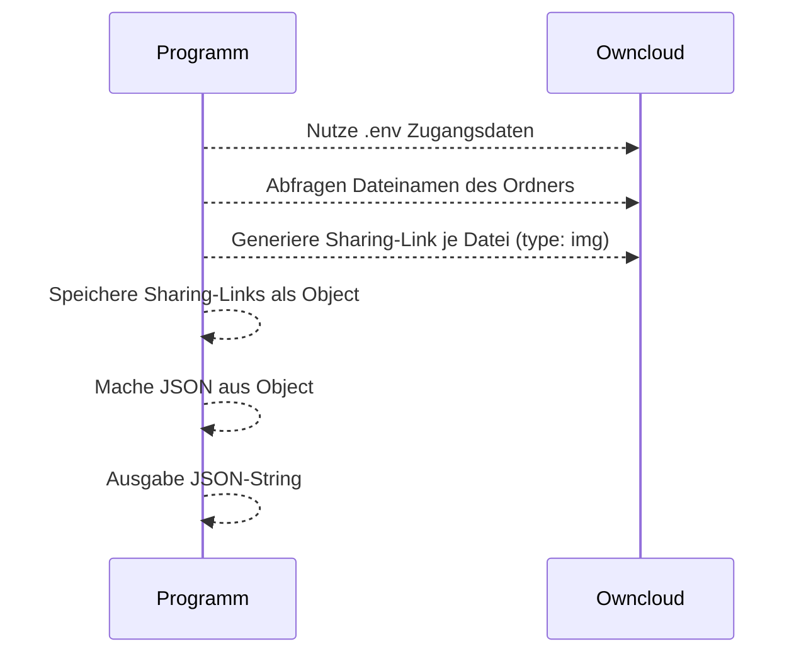

# Owcloud - Sharing Automation

Manchmal möchte man diverse Bilder eines Owncloud-Ordners auf einer externen Website einbinden. Dazu muss ein **Sharing-Link** eines jeden Bildes erstellt werden.

Anschließend kann der Sharing-Link mittels beifügen von **/download** als Bild per HTML genutzt werden. Z.B. ``.

Wenn man jedoch sehr viele Bilder in einem Ordner hat, dann ist die Generierung der jeweiligen einzelnen Sharing-Links sehr mühsam.

Dafür dient dieses Node-JS Skript, das in einem Docker-Container aufgerufen wird.

---
## Schema



---

## Installation

Die `.env`-Datei muss beigefügt/angepasst werden. Siehe `.env-sample`.

```
SERVER=<owncloudurl>
USER=<username>
PASSWORD=<pw>
CLOUDDIR=<relative-path>
```
---

## Starten
```bash
docker-compose up
```

---

## Ausgabe
In der Terminal-Konsole wird ein JSON-String mit den **Sharing-Links aller Dateien als Keys** inkl. **/download**-Zusatz zurückgegeben. Der JSON-String kann in der weiteren Programmierung genutzt werden. Oder man kann sich die Links einfach rauskopieren.

### Beispiel:

```json
{"https://my-owncloud.com/index.php/s/FjARYnzvgvqkiIb/download":"", "https://my-owncloud.com/index.php/s/FAs2dsxssw267/download":""}
```
